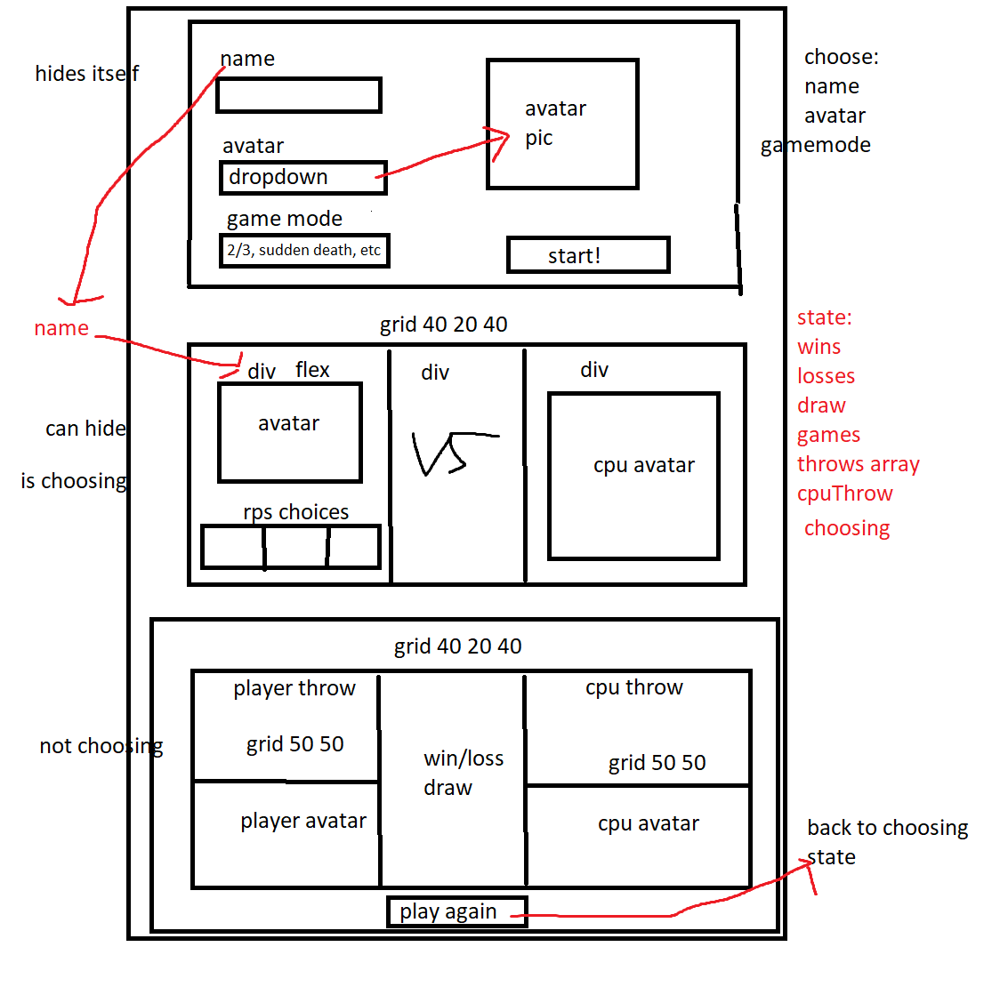

## The Golden Rule:

🦸 🦸‍♂️ `Stop starting and start finishing.` 🏁

1. Limit Work in Progress (WIP)
1. Validate each line of code before moving forward
1. Keep it Simple Simon (KISS)

## Making a plan

1. build html/css with flex and grids. divide into three main sections, avatar-select, choose-throw, results
2. avatar-select start button brings states name avatar and gamemode into choose-throw section. 
3. within choose throw section, clicking a RPS choice calls the handleThrow function which gets the cpuThrow and determines the result. 
    this function also updates the win/loss/draw and total games, as well as changing choosing to 0
4. in the results section we display the result of the latest throw, along with how many wins/losses/draws and games played to this point.

## Guide to `app.js`

File parts:

1. import
2. state
3. components (one or more)
4. page load

Detailed description:

1. Imports 
    - score and getRandomItem function for utils.js for getting random throw and determining winner 
1. State
    - wins
    - losses
    - draws
    - games
    - throwsArr ['rock', 'paper', 'scissors']
    - choosing
    - name
    - playerAvatar
    - cpuThrow
1. View Components
    - updateDisplay() - assigning hidden element to sections that are not needed and updating classes of other sections
    - playAgain button updates choosing to 1
1. Handler Logic
    - Functions that perform actions based on events
    - directly in event handlers or grouped into `handleAction` functions
    - (call third party services)
    - Apply application logic
    - Update state
    - Call display functions to update view
    - handleThrow(player) will take in a value for the player based on the button clicked in the player-choice section. It updates
        wins losses draws and total games along with choosing to 0

### Components

Logically grouped parts of the UI. A simple app may only have one component. Break each of these sections down into:

1. Define variables and assign via document methods (`getElementById`). A DOM element should only ever belong to one component
1. Display functions. These utilize the state and dom variables to perform dom updates. They may utilize user-facing formatting functions
1. Subscribe to needed events on DOM elements. These should update state or call state update functions

1. avatar-select
    - nameInput
    - avatarInput
    - avatarDisplay
2. choose-throw
    - playerAvatar
    - playerName
    - rock
    - scissors
    - paper
    - vs
    - cpuAvatar
3. results
    - player-win-loss-draw
    - playerThrow
    - cpu-win-loss-draw
    - cpuThrow
    - text-result

### Import

If needed, import functions and other JavaScript from their own modules. These will generally be pure functions:

1. scoring logic imported from utils score(player)

